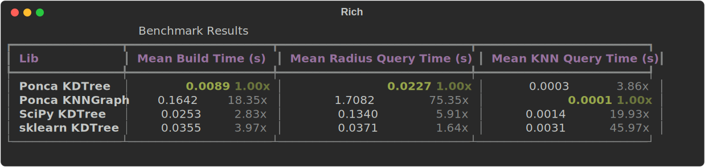

# pyponca_kdtree

Python bindings for the Ponca spatial-partitioning code (from [Ponca](https://github.com/poncateam/ponca) )
## How to build

To build the lib in an existing environment:

```bash
pip install pybind11 scikit-build-core
pip install -e . --no-build-isolation
```

After installation, verify that the module imports:

```bash
python -c "from ponca_kdtree import KdTree, KnnGraph; print(KdTree, KnnGraph)"
```


### small benchmark result (from [bench.py](./scripts/bench.py))

